<h1 align="center">ChatPals</h1>

<h3 align="center">It's a MERN Stack Single-Page E-Commerce Web-Application</h3>

<h2 align="center">🖥️ Tech Stack</h2>

<h4 align="center">Frontend:</h4>

  
  
  
  

<h4 align="center">Backend:</h4>

  
  
  
  

## Sections
The Web-App contains 5 main sections: **Authentication**, **Home**, **Search**, **Product-Page**, **Dashboard** and **Cart/Checkout**.

 

### Authentication
#### You can Authenticate safely with you google account or create an account manually .
<table>
  <tr>
    <td>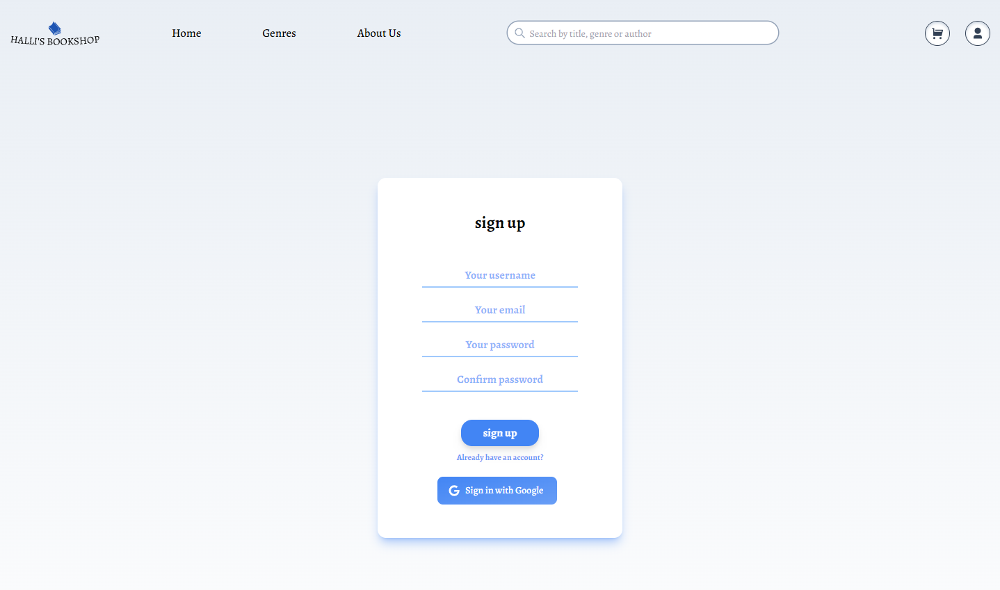</td>
    <td align="center">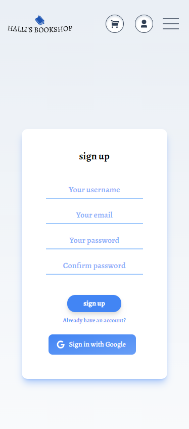</td>
  </tr>
  <tr>
    <td>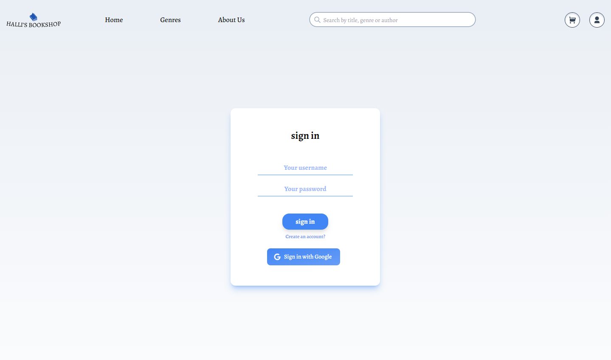</td>
    <td align="center">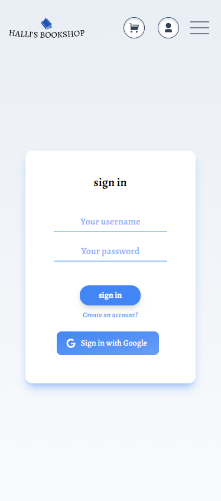</td>
  </tr>
</table>

### Home
#### The Home Section contain a slider that displays the last 6 Books posted by the platform sellers and a list of featured sellers with a card carousel of their last 6 posted books .

https://github.com/mouad-halli/Hallis-BookShop/assets/123669974/e02528c9-2b6e-4890-8745-8bc226f0de0a

### Search
#### You can search for a book by its name, author name or its genre, you can hover over a search item to read the book's description or add the book to your cart, if you want more information about the book you can access the book page by clicking on the item .
<table>
  <tr>
    <td>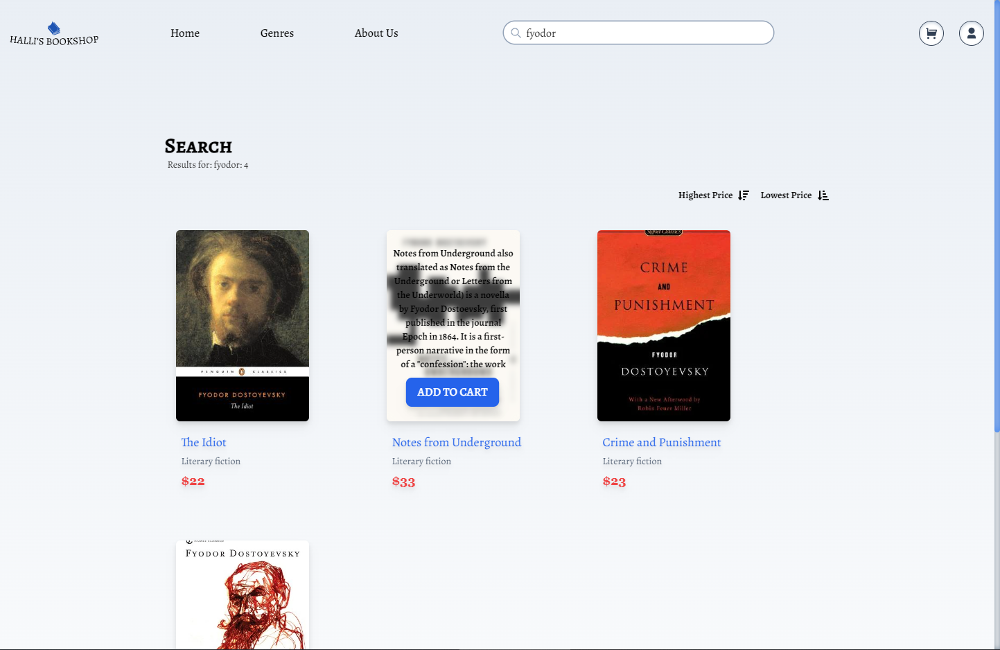</td>
    <td>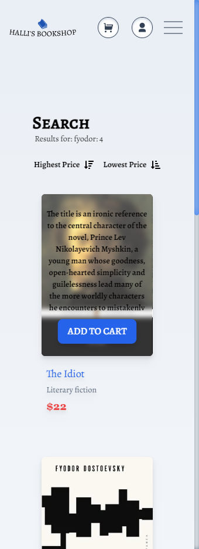</td>
  </tr>
</table>

### Product-Page
#### This Section contains all information about a certain book, and a list of 4 books similar to the current book.

https://github.com/mouad-halli/Hallis-BookShop/assets/123669974/5729b014-181f-4f85-ab8c-1f27475693d6

### Dashboard - This Section contains Products, Orders(Under-Construction) and Settings Pages
####  - In the Products page you can Post a book to sell, update or delete previous Products .

<table>
   <tr>
    <td>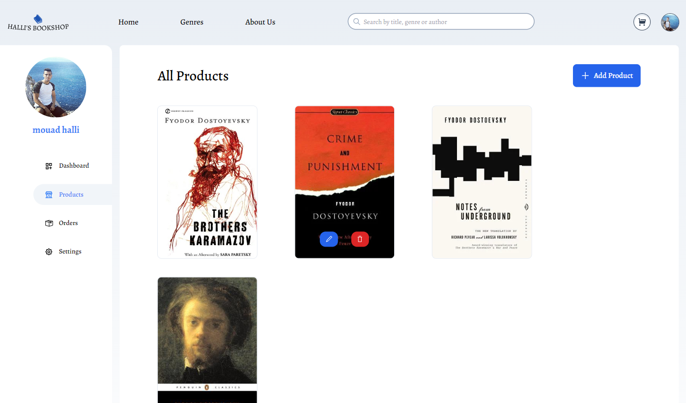</td>
    <td>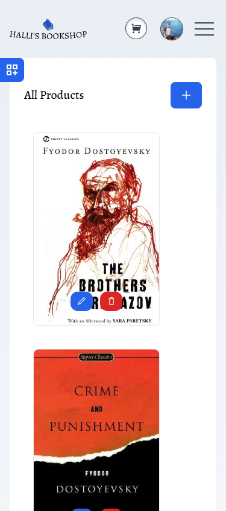</td>
  </tr>
  <tr>
    <td>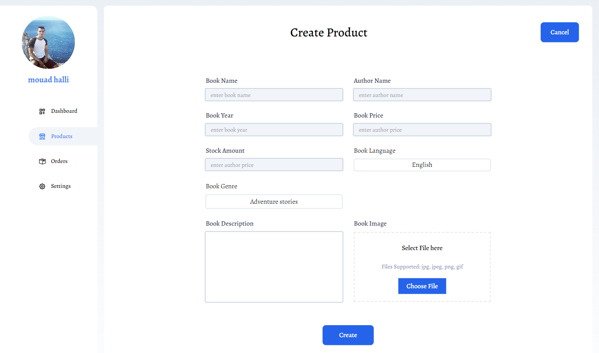</td>
    <td>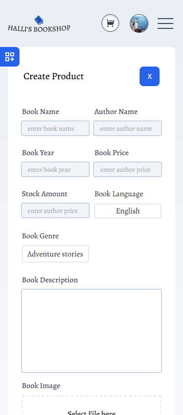</td>
  </tr>
  <tr>
    <td>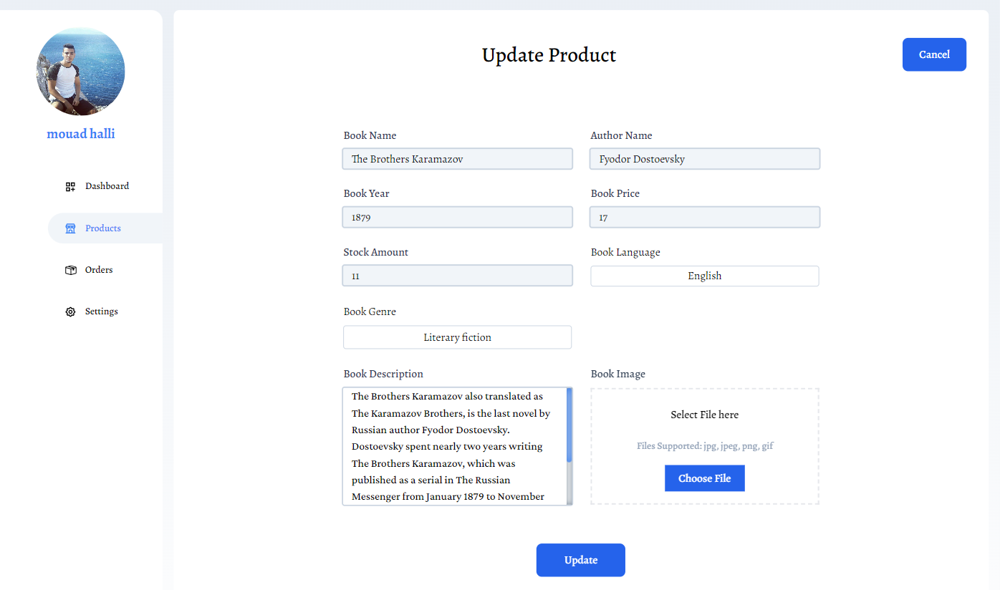</td>
    <td>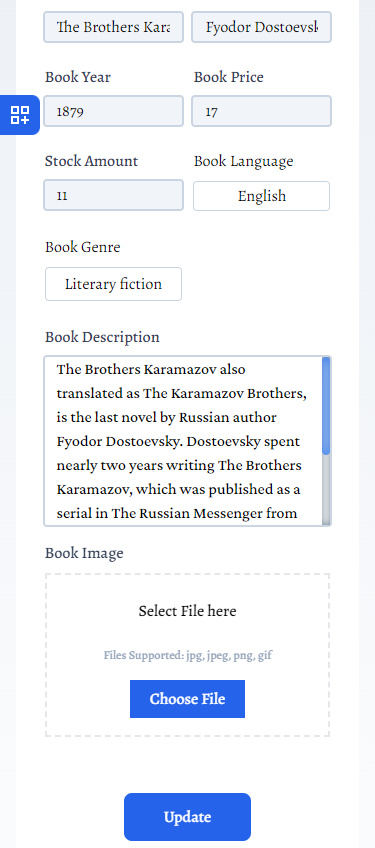</td>
  </tr>
</table>

####  - In the Orders page you can track all the orders buys and sells you made and mention their state (delivered, picked, shipped ...) (UNDER-CONSTRUCTION)

<!-- <table>
  <tr>
    <td></td>
    <td></td>
    <td></td>
  </tr>
</table> -->

####  - In the Settings page you can create, update or delete your picture, personal information and address information.

<table>
  <tr>
    <td>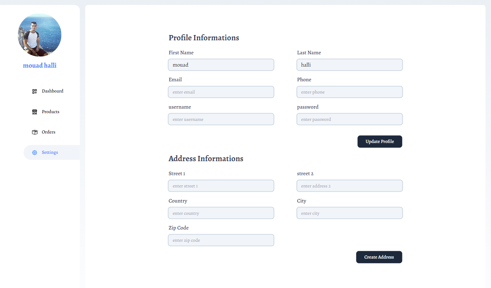</td>
    <td>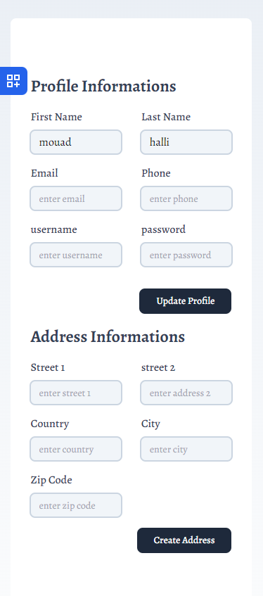</td>
  </tr>
</table>
  
### Cart/Checkout
#### In this Section you can manage you cart items, delete an item increase or decrease its quantity, see your cart Total price and pass to checkout where you can confirm you personal and shipping information, after that you will be redirected to a stripe session where you can pay with credit card or google pay .
  
<table>
  <tr>
    <td>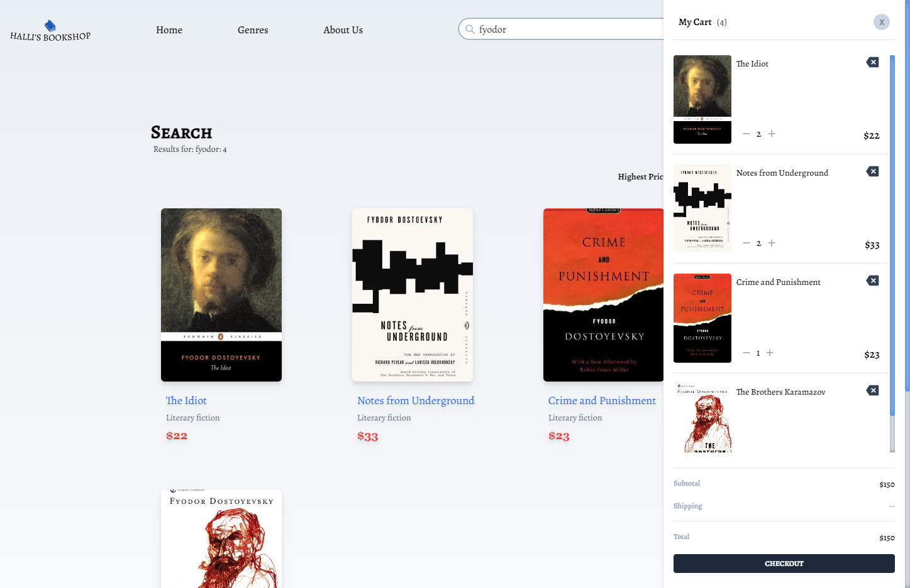</td>
    <td>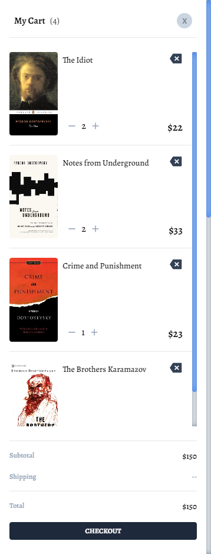</td>
  </tr>
  <tr>
    <td>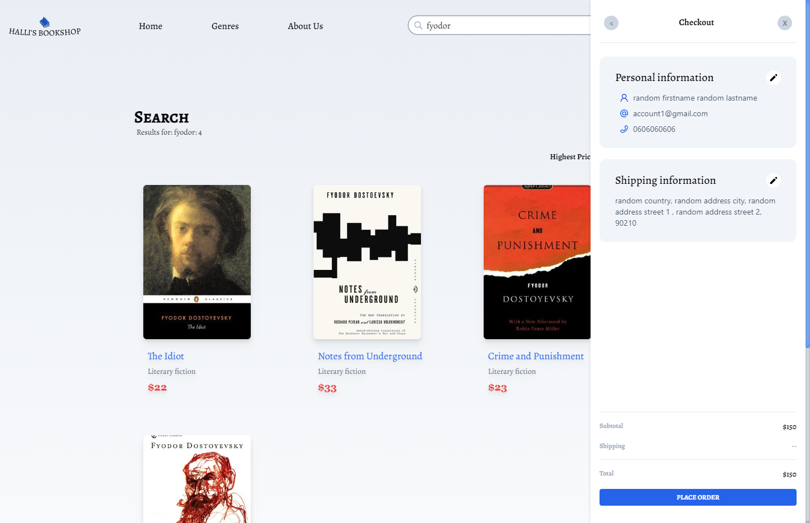</td>
    <td>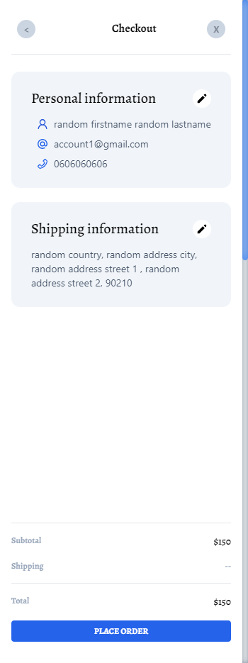</td>
  </tr>
</table
  
